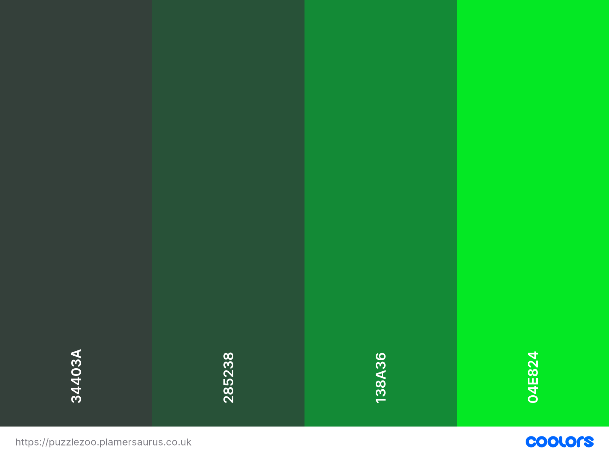

<h1 align="center">Puzzle Zoo Website</h1>

[View the live project here.](https://puzzlezoo.plamersaurus.co.uk)

This site provides an example of an interactive user experience.  This is in the form of a simple jigsaw type puzzle that the user must successfully complete.  It demostrates drag and drop interaction of the puzzle pieces and start and change actions to select a new picture and scramble the pieces.

I decided to aim it more at children and base the puzzles on a zoo theme with colourful cartoon animals to solve.

<h2 align="center"></h2>

## User Experience (UX)

-   ### User stories

    -   #### First Time Visitor Goals

        1. As a First Time Visitor, I want to easily interact with the site.
        2. As a First Time Visitor, I want to be able to easily understand the rules of the game.
        3. As a First Time Visitor, I want to be able to complete the challenge.

    -   #### Returning Visitor Goals

        1. As a Returning Visitor, I want to solve different challenges.

    -   #### Frequent User Goals
        1. As a Frequent User, I want to explore social media links.
        2. As a Frequent User, I want to solve different challenges.

- - -

## Design

### Colour Scheme

The website uses a palette of green based colours that compliment the images. The colour palette was created using the [Coolors](https://coolors.co/) website.

### Typography

Google Fonts was used for the main text and, headings use an imported font:

* Wonderbar font is used for headings on the site. It is available from https://www.fontspace.com/wonderbar-font-f24540.

* Bubblegum Sans is used for the main text on the site.  

### Imagery

All artwork was downloaded from the internet. I have credited these in the [credits](#Credits) section.

*   ### Wireframes

    -   Initial plan idea - [View](docs/initialdesigns.jpg)

    -   Main display Wireframe - [View](docs/main-wireframe.jpg)

    -   Mobile Wireframe - [View](docs/mob-wireframe.jpg)

## Deployment & Local Development

### Deployment

Github Pages was used to deploy the live website. The instructions to achieve this are below:

1. Log in (or sign up) to Github.
2. Find the repository for this project, puzzlezoo.
3. Click on the Settings link.
4. Click on the Pages link in the left hand side navigation bar.
5. In the Source section, choose main from the drop down select branch menu. Select Root from the drop down select folder menu.
6. Click Save. Your live Github Pages site is now deployed at the URL shown.

### Local Development

#### How to Fork

To fork the puzzlezoo repository:

1. Log in (or sign up) to Github.
2. Go to the repository for this project, neil9669/puzzlezoo.
3. Click the Fork button in the top right corner.

#### How to Clone

To clone the puzzlezoo repository:

1. Log in (or sign up) to GitHub.
2. Go to the repository for this project, neil9669/puzzlezoo.
3. Click on the code button, select whether you would like to clone with HTTPS, SSH or GitHub CLI and copy the link shown.
4. Open the terminal in your code editor and change the current working directory to the location you want to use for the cloned directory.
5. Type 'git clone' into the terminal and then paste the link you copied in step 3. Press enter.

- - -

## Technologies Used

### Languages Used

- [HTML5](https://en.wikipedia.org/wiki/HTML5)
- [CSS3](https://en.wikipedia.org/wiki/Cascading_Style_Sheets)
- [JavaScript EC6](https://en.wikipedia.org/wiki/ECMAScript_version_history#6th_Edition_%E2%80%93_ECMAScript_2015)
- [jQuery](https://en.wikipedia.org/wiki/jQuery)

### Frameworks, Libraries & Programs Used

1. [Bootstrap 4.4.1:](https://getbootstrap.com/docs/4.4/getting-started/introduction/)
   - Bootstrap was used to assist with the responsiveness and styling of the website.
1. [Google Fonts:](https://fonts.google.com/)
   - Google fonts were used to import the 'Titillium Web' font into the style.css file which is used on all pages throughout the project.
1. [Font Awesome:](https://fontawesome.com/)
   - Font Awesome was used on all pages throughout the website to add icons for aesthetic and UX purposes.
1. [jQuery:](https://jquery.com/)
   - jQuery came with Bootstrap to make the navbar responsive but was also used for the smooth scroll function in JavaScript.
1. [Git](https://git-scm.com/)
   - Git was used for version control by utilizing the Gitpod terminal to commit to Git and Push to GitHub.
1. [GitHub:](https://github.com/)
   - GitHub is used to store the projects code after being pushed from Git.

## Testing

Testing was ongoing throughout the project using dev tools and console.log() output for jQuery/JS validation.

### W3C Validator

The W3C validator was used to validate the HTML on the website. It was also used to validate CSS in the style.css file.
It suggests removing trailing slashes but this is enforced be pretter VScode extension.  My CSS validates but there are comments regaring 3rd party libraries.  

* [Index Page HTML](docs/testing/w3c/w3c-html.png)
* [style.css CSS](docs/testing/w3c/w3c-css.png)

### Lighthouse

I used Lighthouse within the Chrome Developer Tools to allow me to test the performance, accessibility, best practices and SEO of the website.

#### Index Page

Initial lighthouse testing :

 

Suggestions:

1. serve images in next-gen formats. Lighthouse suggests using image formats such as WebP & AVIF to improve compression and lead to faster downloads and less data consumption.  I have now converted the logo and slide images to webp format using Birme.

Final lighthouse testing:

- - -

# Credits

### Imagery

* [Puzzle Zoo background image by brgfx](https://www.freepik.com/free-vector/border-template-with-cute-animals_6997467.htm)
* [Elephant image by brgfx](https://www.freepik.com/free-vector/wild-animals-white-background_1170727.htm)
* [Monkey, Panda, Tiger and Turtle by brgfx](https://www.freepik.com/free-vector/set-cute-animals_4606801.htm)
* [Monkey Family by brgfx](https://www.freepik.com/free-vector/isolated-forest-scene-with-naughty-monkeys_21197276.htm)

Elephant Family
<a href="https://www.freepik.com/free-vector/elephant-family-with-other-wild-animals-forest-scene_16456729.htm#page=6&query=elephants%20cartoon&position=39&from_view=search&track=ais">Image by brgfx</a> on Freepik

Panda Family 
<a href="https://www.freepik.com/free-vector/scene-with-cute-pandas-park_5934934.htm#query=pandas%20by%20water%20cartoon&position=0&from_view=search&track=ais">Image by brgfx</a> on Freepik

Turtle Family
<a href="https://www.freepik.com/free-vector/scene-with-tortoise-park_5982439.htm#query=turtles%20family%20cartoon&position=1&from_view=search&track=ais">Image by brgfx</a> on Freepik

Tiger Family
<a href="https://www.vecteezy.com/free-vector/life">Life Vectors by Vecteezy</a>

### Code

- [Based on tutorial coded here]().

### Content

- All content was written by the developer.

- Based on code snippets as above

### Acknowledgements

- My Mentor for continuous helpful feedback.

- Tutor support at Code Institute for their support.